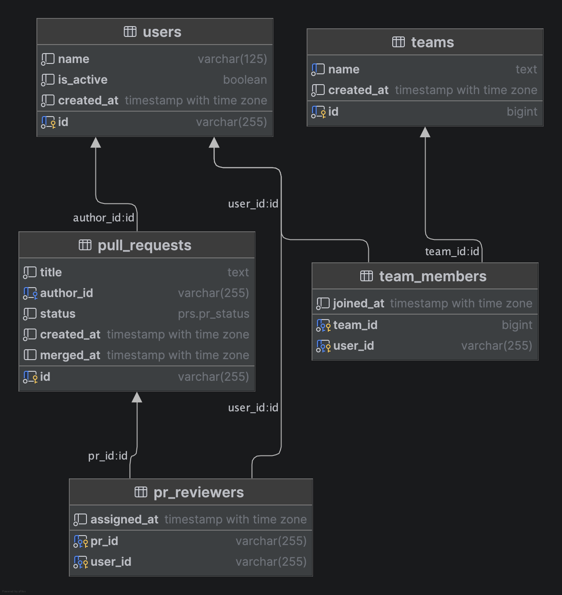

# pr-reviewer-assignment-service

PR Reviewer Assignment Service  
Тестовое задание, осень 2025 (Avito Trainee Backend).

На этом этапе настроена инфраструктура проекта:

- PostgreSQL в Docker
- миграции через `migrate/migrate` в отдельном контейнере
- backend-приложение в Docker
- управление через `Makefile`

Дальше поверх этого будет развиваться бизнес-логика сервиса распределения ревьюверов.

---

## Стек

- **Go** — backend-сервис (сборка в Docker)
- **PostgreSQL 17 (alpine)** - основная БД
- **golang-migrate** (образ `migrate/migrate`) - применение SQL-миграций
- **Docker + Docker Compose**
- **Makefile** для удобных команд

---

##  ERD Диаграмма базы данных



---

## Архитектура HTTP-слоя

На этом этапе в проекте появились три ключевых файла, отвечающих за базовый HTTP-слой backend-приложения:

### `internal/app/app.go` - инициализация приложения (App)
Здесь создаётся структура `App`, которая отвечает за:
- подключение к базе данных (pgxpool),
- создание корневого HTTP-роутера,
- запуск приложения (`Run`),
- корректное завершение работы (`Close`).

Файл не содержит маршрутов или хэндлеров - он только собирает базовые зависимости.

---

### `internal/http/router/` - реализация кастомного Router
Файл `internal/http/router/router.go` содержит собственную реализацию Router поверх `http.ServeMux`.

Функциональность:
- группировка маршрутов (`Group("/prefix")`)
- регистрация методов (`GET`, `POST`, `PUT`, `DELETE`)
- привязка обработчиков через метод + путь  
  (используется схема `"METHOD /path"` внутри ServeMux)

Этот Router — низкоуровневый слой, который не знает ничего о логике приложения.

---

### `internal/http/router.go` - регистрация маршрутов (Routes)
Файл определяет функцию:

```go
func RegisterRoutes(h RoutesHandlers) http.Handler {}
```
Она отвечает за:
- создание групп маршрутов (/users, /teams, /prs, /api/v1 и т.д.),
- привязку HTTP-маршрутов к хэндлерам,
- возврат готового http.Handler для запуска внутри main.go.

На текущем этапе здесь задаётся базовый каркас роутинга, который будет расширяться по мере появления новых хэндлеров.

---

## PullRequests Logic

Этот раздел собирает ключевую доменную логику, которая лежит в основе распределения ревьюверов и поведения PR-сервиса.

### Основные правила

1. **Ревьюверы всегда выбираются только из активных членов команды автора.**

    - Пользователь считается кандидатом, только если:
        - состоит в той же команде, что и автор PR,
        - его `is_active = true`,
        - он не является автором PR,
        - он не является заменяемым ревьювером (в случае reassign).

2. **Ревьюверы сортируются по минимальному числу назначенных ревью (`PRReviews`).**

   Это распределяет нагрузку равномерно.

3. **Максимум 2 ревьювера на PR.**  
   Значение параметра задаётся константой `PRReviewers = 2`.

4. **merge — идемпотентная операция.**
    - повторный вызов `/pullRequest/merge` не меняет `merged_at`,
    - возвращает итоговое состояние PR.

5. **reassign всегда ищет кандидатов только в _команде автора PR_.**

   Это исключает случаи, когда заменяемый ревьювер состоит в другой команде, и предотвращает ошибку `NO_CANDIDATE`, если фактические кандидаты есть у автора.

6. **Кандидаты при reassign выбираются только среди активных участников.**

   Если все участники команды автора `is_active = false` (кроме автора) — корректно возвращается `NO_CANDIDATE`.

####  Обновлённое доменное правило

> Если заменяемый ревьювер состоит не в команде автора,  
> reassign всё равно ищет замену **в команде автора PR**,  
> а не в команде заменяемого.

Это исправляет ситуацию, когда в команде автора есть 4 активных разработчика,  
а кандидат выбирался по ошибке из другой команды.

---

## API
API доступно по адресу:
http://localhost:8080

Swagger UI (генерируется через swaggo)
будет доступен здесь:

👉 http://localhost:8080/swagger/index.html
### Users tag

В сервисе реализованы две ручки Users, соответствующие спецификации OpenAPI.

---

#### POST /users/setIsActive
Устанавливает флаг активности пользователя.

**Описание:**
Обновляет поле `is_active` у пользователя и возвращает обновлённый объект.

**Тело запроса:**
```json
{
  "user_id": "u2",
  "is_active": false
}
```

**Успешный ответ (200):**
```json
{
  "user": {
    "user_id": "u2",
    "username": "Bob",
    "team_name": "backend",
    "is_active": false
  }
}
```

**Ошибки:**
- `400 INVALID_JSON / MISSING_FIELD`
- `404 USER_NOT_FOUND`
- `500 INTERNAL_ERROR`

---

#### GET /users/getReview
Возвращает PR'ы, в которых пользователь является ревьювером.

**Query-параметры:**
- `user_id` — обязательный

**Пример:**
```
GET /users/getReview?user_id=u2
```

**Успешный ответ (200):**
```json
{
  "user_id": "u2",
  "pull_requests": [
    {
      "pull_request_id": "pr-1001",
      "pull_request_name": "Add search",
      "author_id": "u1",
      "status": "OPEN"
    }
  ]
}
```

**Ошибки:**
- `400 MISSING_FIELD` — если отсутствует user_id
- `500 INTERNAL_ERROR`

---

### Team tag

В задании по OpenAPI для Teams требовалась ручка только на создание команды (`/team/add`) и возвращение ошибки `TEAM_EXISTS`, если команда с таким именем уже есть.

На практике при разработке сразу возник вопрос:

> "А как изменять состав команды, когда нужно добавить/удалить участников или поменять активность?"

Чтобы не плодить отдельные ручки и упростить клиентский код, было принято решение **расширить поведение** `POST /team/add`:

- если команда **не существует** — она создаётся (как в исходном требовании),
- если команда **уже существует** — этот же метод:
    - обновляет состав участников в таблице `team_members` (добавляет новых, удаляет отсутствующих),
    - обновляет флаги `is_active` у переданных пользователей.

Таким образом, `/team/add` работает как **upsert команды**: "создать или синхронизировать состав по переданному списку участников".

---

#### POST /team/add

Создать новую команду **или** обновить существующую.

**Описание:**

- При первом вызове с новым `team_name` — создаёт команду и связывает её с участниками.
- При повторных вызовах с тем же `team_name`:
    - для всех переданных `members` обновляет `is_active` у пользователей,
    - в таблице `team_members`:
        - добавляет новых `user_id`, которых раньше не было в этой команде,
        - удаляет тех, кого больше нет в списке `members`.

**Тело запроса:**

```json
{
  "team_name": "backend",
  "members": [
    {
      "user_id": "u1",
      "username": "Alice",
      "is_active": true
    },
    {
      "user_id": "u2",
      "username": "Bob",
      "is_active": false
    }
  ]
}
```

**Успешный ответ (201)**
```json
{
  "team_name": "backend",
  "members": [
    {
      "user_id": "u1",
      "username": "Alice",
      "is_active": true
    },
    {
      "user_id": "u2",
      "username": "Bob",
      "is_active": false
    }
  ]
}
```
---

На уровне реализации состав команды обновляется транзакционно:

- читается текущий список участников,

- строится diff по user_id,

- выполняются нужные INSERT/DELETE в users.team_members,

- для переданных пользователей обновляется is_active.

---

**Ошибки:**

400 INVALID_JSON / MISSING_FIELD — невалидный запрос;

404 NOT_FOUND — если какой-то из переданных пользователей не найден;

409 TEAMS_CONFLICT — если для существующей команды передан пользователь, который уже привязан к другой команде;

500 INTERNAL_ERROR.

---

### PullRequests tag

Сервис реализует полный цикл работы с PR внутри команды:  
автоматическое назначение ревьюверов, получение списка PR для ревью,  
идемпотентный merge и переназначение ревьюверов.

---

#### POST /pullRequest/create

Создаёт pull request и автоматически назначает до двух ревьюверов.

**Логика:**

- определяется команда **автора PR**;
- выбираются **только активные** участники этой команды (is_active = true);
- автор PR не может быть ревьювером;
- кандидаты сортируются по минимальному количеству назначенных ревью (`PRReviews`);
- выбираются до `PRReviewers = 2` участников.

**Request:**

```json
{
  "pull_request_id": "pr-1001",
  "pull_request_name": "Add search feature",
  "author_id": "u1"
}
```

**Response (201):**
```json
{
  "pr": {
    "pull_request_id":   "pr-1001",
    "pull_request_name": "Add search feature",
    "author_id":         "u1",
    "status":            "OPEN",
    "assigned_reviewers": ["u2", "u3"]
  }
}

```

**Ошибки:**

- INVALID_JSON — неверный формат запроса

- NOT_FOUND — не найден автор или его команда

- PR_EXISTS — PR с таким id уже существует

- INTERNAL_ERROR — сбой сервиса

---

#### POST /pullRequest/merge

Идемпотентно переводит PR в статус MERGED.

##### Правила:

- повторный вызов не меняет данные;

- merged_at выставляется только один раз;

- если PR уже MERGED — возвращается текущее состояние;

- если PR не существует — ошибка NOT_FOUND.

**Request:**
```json
{
"pull_request_id": "pr-1001"
}
```

**Response (200):**
```json
{
    "pr": {
        "pull_request_id":   "pr-1001",
        "pull_request_name": "Add search feature",
        "author_id":         "u1",
        "status":            "MERGED",
        "assigned_reviewers": ["u2", "u3"],
        "merged_at":          "2025-11-16T20:01:23Z"
    }
}
```

**Ошибки:**

- NOT_FOUND — PR не существует

- INTERNAL_ERROR — сбой сервиса
---
#### POST /pullRequest/reassign

Переназначает конкретного ревьювера на другого.

##### Основные правила переназначения:

- Кандидаты выбираются только из команды автора PR, а не заменяемого ревьювера.

- Кандидаты должны быть активными (is_active = true).

- Новые ревьюверы сортируются по минимальному количеству ревью (PRReviews).

- Автор PR не может быть ревьювером.

- Нельзя менять ревьюверов у MERGED PR.

- Если нет подходящих кандидатов — возвращается NO_CANDIDATE.

**Request:**
```json
{
"pull_request_id": "pr-1001",
"old_reviewer_id": "u2"
}
```

**Response (200):**
```json
{
"pr": {
        "pull_request_id":   "pr-1001",
        "pull_request_name": "Add search feature",
        "author_id":         "u1",
        "status":            "OPEN",
        "assigned_reviewers": ["u3", "u5"]
    },
    "replaced_by": "u5"
}
```

**Ошибки:**

- NOT_FOUND — PR или пользователь не существует

- NOT_ASSIGNED — старый ревьювер не назначен на этот PR

- PR_MERGED — PR уже смержен

- NO_CANDIDATE — нет активных кандидатов в команде автора

- INTERNAL_ERROR — сбой сервиса
---

Возвращают ошибки в едином формате `ErrorResponse`, используя общий helper `response.Error(...)`.

---

## Быстрый старт

### 1. Зависимости

Нужно установить:

- [Docker](https://www.docker.com/)
- [Docker Compose](https://docs.docker.com/compose/)
- `make` (обычно уже есть в Linux/macOS)

### 2. Поднять окружение

#### Основной запуск:

```bash
make up
```

#### Альтернативный запуск:

Если тебе не нужно разделять шаги (db → migrate → app), ты можешь поднять весь стек одной командой:

```bash
docker compose up --build
